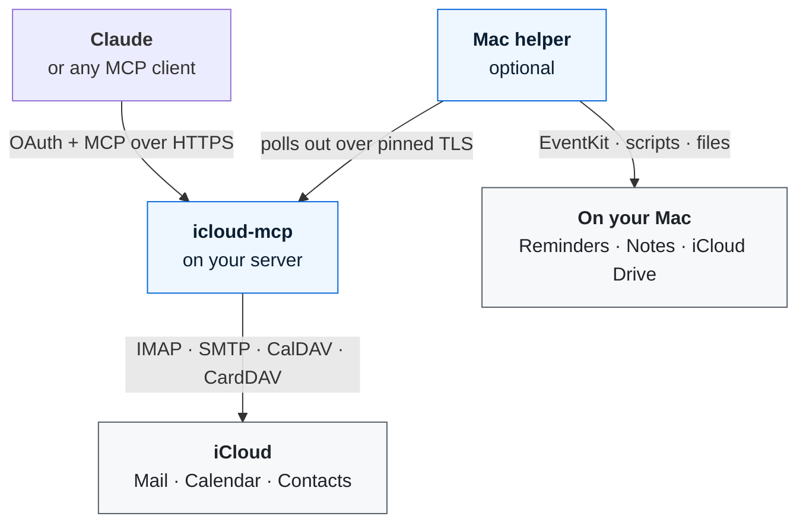

<div align="center">

<!-- mcp-name: io.github.epinethrone/icloud-mcp -->


# iCloud MCP

**Give Claude your iCloud: Mail, Calendar, Contacts, Reminders, Notes and iCloud Drive.**
**Self-hosted, single-owner, and built around your approval, not the model's good behaviour.**

[](https://pypi.org/project/icloud-mcp-server/)
[](https://registry.modelcontextprotocol.io/v0/servers?search=io.github.epinethrone/icloud-mcp)
[](https://github.com/epinethrone/icloud-mcp/actions/workflows/tests.yml)
[](https://github.com/epinethrone/icloud-mcp/blob/main/LICENSE)
[](https://github.com/epinethrone/icloud-mcp/blob/main/pyproject.toml)
[](https://modelcontextprotocol.io)
[](https://github.com/epinethrone/icloud-mcp/blob/main/docker-compose.yml)
[](#quick-start)
[](#tools)
[](https://glama.ai/mcp/servers/epinethrone/icloud-mcp)

[Why](#why-icloud-mcp) · [What you can ask](#what-you-can-ask-claude) · [How it works](#how-it-works) · [Security](#security-first) · [Quick start](#quick-start) · [Run locally](#run-it-locally-claude-desktop-and-claude-code) · [Tools](#tools) · [Mac helper](#reminders-notes-and-icloud-drive-through-your-mac) · [Configuration](#configuration) · [Troubleshooting](#troubleshooting)

</div>

---

A self-hosted [Model Context Protocol](https://modelcontextprotocol.io) server that connects **Claude** (or any MCP client) to your **Apple iCloud** account through one custom connector. Mail, Calendar and Contacts speak the standard IMAP, SMTP, CalDAV and CardDAV protocols. Reminders, Notes and iCloud Drive, which Apple only exposes on its own devices, go through an optional helper on your Mac.

> [!NOTE]
> **Not affiliated with Apple.** iCloud is a trademark of Apple Inc. This is an independent open-source project.

## Why iCloud MCP

| Feature | What it means for you |
|---|---|
| 🍎 **All of iCloud in one connector** | 48 tools across Mail, Calendar, Contacts, Reminders, Notes and iCloud Drive, instead of a separate integration for each. |
| 🔐 **Your credentials never leave your server** | Apple offers no OAuth for these protocols, so an app-specific password lives only in your server's environment. Claude signs in to *your* server through its own single-owner OAuth and never sees it. |
| ✋ **You approve what leaves** | Outgoing mail is queued for your approval in a browser by default. Invitations to other people are blocked unless you allow them. Deletes go to the Trash. |
| 🛡️ **Built for prompt injection** | Every email, event, note and file is marked as untrusted data, and the dangerous actions are gated by configuration rather than by asking the model nicely. |
| 💻 **Server or no server** | Host it once for Claude on the web and your phone, or run it locally for Claude Desktop and Claude Code with one command: no domain, tunnel or Docker needed. |
| 🧪 **Tested against the real iCloud** | 288 offline tests on every push (Python 3.11 to 3.13), plus integration tests against local mail, calendar and contacts servers, plus manual runs against a live account for the quirks only Apple's servers show. |

## What you can ask Claude

- *"Find the email from my landlord about the heating and draft a polite reply."*
- *"What's on my calendar next week? Move Thursday's dentist appointment to Friday at the same time."*
- *"Add Anna's new work address to her contact card."*
- *"Remind me to renew my passport on the first of next month."*
- *"Move all my recipe notes into a Recipes folder, and delete the three empty notes."*
- *"Find my tax return PDF in iCloud Drive and tell me what I paid last year."*

## How it works



The server runs anywhere Docker runs (a home server, a Raspberry Pi, a small VPS) behind a public HTTPS address such as a Cloudflare Tunnel. If you only use Claude Desktop or Claude Code, you can skip all of that and [run it locally](#run-it-locally-claude-desktop-and-claude-code) instead. The Mac helper is only needed for Reminders, Notes and iCloud Drive. It connects *out* to the server, so your Mac never opens a port.

## Security first

A connector that can read your mail and act for you is a prompt-injection target: a hostile email or calendar invite can contain text that tries to steer the agent. The server labels all such content as untrusted and tells agents to treat it as data, but **that is a request to a language model, not a guarantee**. What actually protects you is configuration:

| Risk | Default | Setting |
|---|---|---|
| Agent sends mail on injected instructions | Sending only **queues** the message. You approve it in a browser with your owner password at `/outbox` | `SEND_REQUIRES_APPROVAL=true` |
| Agent emails invitations to strangers | Attendee changes are **blocked** | `ALLOW_CALENDAR_INVITES=false` |
| Agent mails arbitrary addresses | Any address, at most 25 per message | `SEND_ALLOWLIST`, `MAX_RECIPIENTS` |
| Agent destroys mail | Delete moves to Trash; permanent delete is off | `ALLOW_PERMANENT_DELETE=false` |
| Agent destroys notes or files | Notes go to Recently Deleted, Drive files to the Trash. Nothing through the Mac helper is ever deleted permanently | always on |
| Agent changes anything at all | Everything writable | `READ_ONLY=true` for a read-only connector |

In Claude you can also set the send, reply, forward and delete tools to "ask before use". Anyone who obtains the app-specific password has **full access to mail, calendar and contacts** (Apple offers no narrower scope), so protect the server and its `.env` accordingly.

<details>
<summary><b>The full security model</b></summary>

- iCloud credentials exist only in the server environment. Clients hold short-lived bearer tokens for *this* server.
- Clients may register dynamically, but nothing is authorised without the owner password. Redirect hosts are restricted. Tokens are stored as SHA-256 hashes (file mode 600). The approval and outbox pages lock after 10 wrong passwords in 15 minutes (server-wide; existing tokens keep working).
- Every refused sign-in renewal is logged with its reason (already rotated, expired, wrong client, not recognised), never with token values, and unauthenticated callers cannot flood the log: `docker compose logs icloud-mcp | grep 'oauth:'`.
- The MCP endpoint validates `Host` and `Origin`. Tool results carry an untrusted-content notice. HTTP-client request logging is disabled so account identifiers do not reach the logs.
- The Mac bridge runs on its own private TLS port with a self-signed certificate the helper pins by fingerprint, plus a bearer token. It is never served on the public address or through the tunnel. The server sends only an operation name and validated arguments from a fixed list, never script text.
- Single-owner by design: one deployment serves one iCloud account. It is not multi-tenant, and storing other people's app-specific passwords is deliberately out of scope.

</details>

## Quick start

> [!TIP]
> Only using Claude Desktop or Claude Code on one computer? [Run it locally](#run-it-locally-claude-desktop-and-claude-code) instead: no server, domain or tunnel.

**You need:**
- Docker with the compose plugin (or Python 3.11+)
- An Apple Account with two-factor authentication and an **app-specific password** (account.apple.com → Sign-In and Security → App-Specific Passwords)
- A public **HTTPS** address for the server. Claude connects from Anthropic's cloud, so a LAN or VPN address won't work. A [Cloudflare Tunnel](https://developers.cloudflare.com/cloudflare-one/connections/connect-networks/) is the simplest option: outbound only, no port forwarding.
- A Claude plan that supports custom connectors

> [!WARNING]
> Don't put Cloudflare Access or any other login wall in front of the server. Claude's servers can't pass an interactive login, and the server has its own OAuth.

**1. Configure**

```bash
git clone https://github.com/epinethrone/icloud-mcp.git && cd icloud-mcp
cp .env.example .env     # fill in ICLOUD_USERNAME, ICLOUD_APP_PASSWORD, ICLOUD_DISPLAY_NAME,
                         # MCP_PUBLIC_URL (your https address, no trailing slash), MCP_OWNER_PASSWORD
chmod 600 .env
```

`MCP_OWNER_PASSWORD` is a new random password (12+ characters) that **you** type when approving a client and on the outbox page. It is not your Apple password. `./configure.sh` asks for the secrets with silent prompts if you prefer.

**2. Check your credentials against the real iCloud before exposing anything**

```bash
docker build -t icloud-mcp:local .
docker run --rm --env-file .env icloud-mcp:local python -m icloud_mcp.selftest                              # logs in to IMAP, SMTP, CalDAV, CardDAV; sends nothing
docker run --rm --env-file .env icloud-mcp:local python -m icloud_mcp.selftest --probe-sent you@example.com   # sends ONE test mail
```

If a login fails, the login name is the usual cause: set `IMAP_USERNAME`, `SMTP_USERNAME`, `CALDAV_USERNAME` or `CARDDAV_USERNAME` separately.

**3. Run it**

```bash
docker compose up -d --build     # listens on 127.0.0.1:8000 only
```

For the bundled Cloudflare Tunnel: create a tunnel, point its public hostname (the host in `MCP_PUBLIC_URL`) at `http://icloud-mcp:8000`, put the token in `.tunnel.env` as `TUNNEL_TOKEN=...`, and start with `docker compose --profile tunnel up -d --build`. Any TLS front (Caddy, nginx) works too, as long as it keeps the `Host` header. `MCP_PUBLIC_URL` must match the public address exactly.

**4. Connect Claude**

Settings → Connectors → Add custom connector → `https://<your-host>/mcp`. Your server shows an approval page: enter the owner password. Reconnect the connector whenever you change tools or settings, because Claude caches tool definitions. To revoke every connected client, delete `oauth_state.json` in the data volume and restart.

**5. Check it works**

In a new chat, open the tools menu: the connector should be listed with its tools. Then try a few read-only requests:

- *"List my mail folders."*
- *"What's on my calendar this week?"*
- *"Find Anna in my contacts."*
- *"Is the Mac helper online?"* (only if you set up the Mac helper)

Then ask Claude to email yourself. With the default settings nothing is sent: the message waits at `https://<your-host>/outbox` until you approve it. If anything fails, see [Troubleshooting](#troubleshooting).

### Approving outgoing mail

With the default `SEND_REQUIRES_APPROVAL=true`, `mail_send`, `mail_reply` and `mail_forward` return `queued_for_owner_approval` and nothing leaves. Open `https://<your-host>/outbox` (bookmark it, and only type the password there, never on a link an agent gives you), enter the owner password, review the exact recipients and text, then approve or discard. Queued messages expire after `OUTBOX_TTL_SECONDS` (24 hours by default) and are released at most once.

## Run it locally (Claude Desktop and Claude Code)

The same server can run on your own computer as a local MCP server. Your desktop client starts it when it needs it and talks to it over stdio, so there is no public address, tunnel, Docker or OAuth. Claude on the web and on your phone cannot reach it, which is the trade-off.

**1. Put your settings in a file only you can read**

```bash
mkdir -p ~/.icloud-mcp && chmod 700 ~/.icloud-mcp
cat > ~/.icloud-mcp/icloud.env <<'END'
ICLOUD_USERNAME=you@icloud.com
ICLOUD_APP_PASSWORD=xxxx-xxxx-xxxx-xxxx
ICLOUD_DISPLAY_NAME=Your Name
DEFAULT_TIMEZONE=Europe/Berlin
END
chmod 600 ~/.icloud-mcp/icloud.env
```

Any setting from [Configuration](#configuration) can go in this file. `MCP_PUBLIC_URL` and `MCP_OWNER_PASSWORD` are not needed.

**2. Add it to your client** (needs [uv](https://docs.astral.sh/uv/))

Claude Code:

```bash
claude mcp add icloud -- uvx icloud-mcp-server --local --env-file ~/.icloud-mcp/icloud.env
```

Claude Desktop: Settings → Developer → Edit Config, then add this to `claude_desktop_config.json` and restart Claude:

```json
{
  "mcpServers": {
    "icloud": {
      "command": "uvx",
      "args": ["icloud-mcp-server", "--local", "--env-file", "/Users/YOU/.icloud-mcp/icloud.env"]
    }
  }
}
```

If Claude Desktop cannot find `uvx`, use its full path (`which uvx`). Without uv, `pip install icloud-mcp-server` and use `icloud-mcp` as the command.

**How sending works locally.** There is no approval page, so with the default `SEND_REQUIRES_APPROVAL=true` every message Claude sends is saved to your **Drafts** folder instead, and the result says so. You review it in Mail and press Send yourself. Set `SEND_REQUIRES_APPROVAL=false` to let Claude send directly; your client's own "ask before use" setting is then the only check.

**Reminders, Notes and iCloud Drive locally.** Add `ENABLE_REMINDERS=true` (and/or `ENABLE_NOTES`, `ENABLE_DRIVE`) and a `BRIDGE_TOKEN` to the env file, start your client once, then [install the Mac helper](#reminders-notes-and-icloud-drive-through-your-mac) with server `https://127.0.0.1:8001` and the fingerprint from `~/.icloud-mcp/bridge_fingerprint.txt`. In local mode the bridge only listens on `127.0.0.1`. If two clients start the server at once, only the first gets the Mac tools; Mail, Calendar and Contacts work in both.

## Tools

**26 tools** for Mail, Calendar and Contacts, plus **22** more with the optional Mac helper.

<details>
<summary><b>📧 Mail</b> (14)</summary>

| Kind | Tools |
|---|---|
| Read | `mail_list_folders`, `mail_search`, `mail_find_correspondent`, `mail_get_message`, `mail_get_messages` (up to 25 in one call), `mail_get_thread`, `mail_get_attachment` |
| Write | `mail_send`, `mail_reply` (including reply-all), `mail_forward`, `mail_mark`, `mail_move`, `mail_delete` (to Trash), `mail_create_folder` |

- Replies keep the `Re:` subject, `In-Reply-To` and `References`, the right recipients and the quoted original in plain text and HTML. Sent mail is copied to Sent and the original is flagged Answered (forwards get `$Forwarded`). `draft=true` saves to Drafts instead of sending.
- `mail_get_messages` reads a batch (a day's unread mail, a whole thread) in one IMAP round trip, about 7 times faster than one at a time.
- **Stale ids are refused.** Every message comes with its folder's `uidvalidity`; tools that act on a uid accept it back and refuse if iCloud has renumbered the folder since, instead of touching a different message.
- Reading a message does not mark it read. Bcc recipients receive the mail, but the header is stripped on the wire.
- Recipients accept `a@b.com`, `Name <a@b.com>` or `mailto:a@b.com`. Anything else is rejected with a clear error and never silently dropped.

</details>

<details>
<summary><b>📅 Calendar</b> (7)</summary>

`calendar_list_calendars`, `calendar_list_events`, `calendar_find_free_time`, `calendar_get_event`, `calendar_create_event`, `calendar_update_event`, `calendar_delete_event`

- Multiple calendars, recurring events expanded when listing, all-day events, alerts, links, notes and attendees. Editing a recurring event changes the whole series.
- **Finding free time is one call.** `calendar_find_free_time` returns openings of a given length within your hours and chosen weekdays. Travel time counts as busy; events marked free, cancelled events and invitations you declined do not; all-day events are listed separately instead of guessed about.
- **Safe to retry.** `calendar_create_event` and `contacts_create` take an optional `request_id`: if a call times out and is retried with the same one, the first attempt is found instead of creating a duplicate.
- **Apple travel time and map locations.** Events can carry Apple's travel time (by bike, on foot, by car or public transport) and a structured destination, which is what makes Apple draw the map card.
- **Adding a guest leaves everyone else alone.** Updating the guest list merges instead of replacing, so existing guests keep their RSVP and aren't sent the invitation again. Invitations are emailed by iCloud itself and are off unless you allow them.

</details>

<details>
<summary><b>👥 Contacts</b> (5)</summary>

`contacts_search`, `contacts_get`, `contacts_create`, `contacts_update`, `contacts_delete`

- Contacts are fetched whole, cached and searched locally by name, nickname, company, email or phone, ignoring accents. A contact with no email comes back with `has_email: false`, so an agent asks instead of guessing.
- **Misspelled names are handled.** `contacts_search` suggests similar-sounding names when nothing matches exactly, and `mail_find_correspondent` finds people you've emailed by approximate name, address or company, reading only message headers. Approximate matches are labelled, and agents must ask you to confirm before sending, inviting or editing on one.
- **Postal addresses** are read and written as street, city, region, postcode and country, with home, work or your own labels ("Holiday house"), stored the way Apple's Contacts app expects.
- Updates keep every field outside the changed ones and use ETags to refuse stale overwrites. Contact photos and notes are never returned.

</details>

<details>
<summary><b>✅ Reminders</b> (6, Mac helper)</summary>

`reminders_lists`, `reminders_list`, `reminders_create`, `reminders_update`, `reminders_complete`, `reminders_delete`

- Runs through Apple's EventKit: every read is live and takes about 20 to 40 ms, however long your lists are. Only active reminders are returned.
- List names can repeat across accounts, so tools accept a `list_id` and refuse an ambiguous name. Due dates are validated as real dates (a bare date means 09:00 local time).

</details>

<details>
<summary><b>📝 Notes</b> (7, Mac helper)</summary>

`notes_folders`, `notes_list`, `notes_read`, `notes_create`, `notes_create_folder`, `notes_move`, `notes_delete`

- Read, create, and **organise**: create folders and subfolders, and move notes between them. The text of an existing note is never edited.
- Move and delete act on one note at a time and need its **current title** as well as its id, so a stale or wrong id changes nothing.
- Delete moves a note to **Recently Deleted**, where you can recover it for about 30 days. It refuses locked notes, and notes already in Recently Deleted, because removing them from there would be permanent. Nothing is ever moved into Recently Deleted.

</details>

<details>
<summary><b>🗂️ iCloud Drive</b> (8, Mac helper)</summary>

`drive_list`, `drive_search`, `drive_info`, `drive_read`, `drive_write`, `drive_create_folder`, `drive_move`, `drive_trash`

- Works on your **whole iCloud Drive** as your Mac keeps it in sync, so every change syncs to your other devices by itself.
- `drive_read` returns text from plain text files, **PDFs** and **Word, RTF, ODT and HTML** documents. Files offloaded by "Optimise Mac Storage" are downloaded first. If that takes too long, the answer says the file is still downloading, instead of timing out.
- `drive_write` creates plain text files. Replacing a file needs `overwrite`, and the old version goes to the Trash. `drive_move` never overwrites.
- **Nothing is ever deleted permanently.** `drive_trash` moves items to the Trash, where you can recover them.
- Paths are relative to the Drive and can't leave it, not through `..` and not through a symbolic link (links that lead outside are not even listed). The Drive's trash folder is off limits.

</details>

<details>
<summary><b>🔌 Status</b> (1)</summary>

`mac_helper_status` says whether the Mac helper is online, when it was last seen and which version it runs.

</details>

## Reminders, Notes and iCloud Drive through your Mac

Apple only exposes Reminders, Notes and iCloud Drive on its own devices, so a small helper ([`mac-helper/`](https://github.com/epinethrone/icloud-mcp/blob/main/mac-helper/README.md)) runs on your Mac and does the work when the server asks.

- **Nothing listens on your Mac.** The helper connects *out* to a private HTTPS port of the server (never the public address, never the tunnel) and long-polls for jobs.
- **No code is ever sent.** The server sends an operation name and validated arguments from a fixed list. Reminders run a small EventKit program the installer builds on your Mac. Notes run static scripts. iCloud Drive runs one fixed Python script under Apple's own Python. In every case the arguments arrive as one JSON value, never as code.
- **Pinned and authenticated.** TLS with a self-signed certificate the helper pins by fingerprint, plus a bearer token.
- **Honest when it's off.** It works while your Mac is on and reachable (home network or VPN). When it isn't, the tools say so.

Enable it in `.env` with any of `ENABLE_REMINDERS=true`, `ENABLE_NOTES=true` and `ENABLE_DRIVE=true`, a `BRIDGE_TOKEN` of at least 32 random characters, and `BRIDGE_BIND` set to the address the Mac reaches the server on. The server logs the certificate fingerprint for the installer, and also writes it to `bridge_fingerprint.txt` in its data folder. Then follow the [Mac helper guide](https://github.com/epinethrone/icloud-mcp/blob/main/mac-helper/README.md).

> [!IMPORTANT]
> **iCloud Drive needs Full Disk Access** for the helper's Python. On macOS 27 the grant only takes effect when the helper runs as the Command Line Tools `Python.app` executable, which is what the installer sets up. Details in the [Mac helper guide](mac-helper/README.md#icloud-drive).

The Notes scripts are adapted from [MrGo2/icloud-mcp](https://github.com/MrGo2/icloud-mcp) (MIT); see [THIRD_PARTY_NOTICES.md](https://github.com/epinethrone/icloud-mcp/blob/main/THIRD_PARTY_NOTICES.md).

## Configuration

Everything is an environment variable. [`.env.example`](https://github.com/epinethrone/icloud-mcp/blob/main/.env.example) has a comment for each one.

<details>
<summary><b>All settings</b></summary>

| Variable | Default | Meaning |
|---|---|---|
| `ICLOUD_USERNAME` | required | The Apple Account you sign in with |
| `ICLOUD_APP_PASSWORD` | required | App-specific password |
| `ICLOUD_EMAIL_ADDRESS` | username | From address (your iCloud address or alias) |
| `ICLOUD_DISPLAY_NAME`, `EMAIL_SIGNATURE` | empty | Sender name; plain-text signature added to sent mail (`\n` = new line) |
| `IMAP_HOST/PORT/SECURITY/USERNAME` | `imap.mail.me.com`, 993, ssl, username | IMAP |
| `SMTP_HOST/PORT/SECURITY/USERNAME` | `smtp.mail.me.com`, 587, starttls, username | SMTP |
| `CALDAV_URL`, `CALDAV_USERNAME`, `CALDAV_REQUIRE_TLS` | `https://caldav.icloud.com`, username, true | CalDAV |
| `CARDDAV_URL`, `CARDDAV_USERNAME` | `https://contacts.icloud.com`, username | CardDAV |
| `DEFAULT_TIMEZONE`, `DEFAULT_CALENDAR` | `UTC`, auto | Timezone for times without an offset; calendar for new events (else "Calendar" or "Home", else the first) |
| `ENABLE_MAIL`, `ENABLE_CALENDAR`, `ENABLE_CONTACTS` | true | Switch whole areas off |
| `ENABLE_REMINDERS`, `ENABLE_NOTES`, `ENABLE_DRIVE` | false | Areas that go through the Mac helper (need `BRIDGE_TOKEN`) |
| `BRIDGE_TOKEN`, `BRIDGE_BIND` | empty, 127.0.0.1 | Mac helper secret (32+ characters) and the address its private port is published on |
| `BRIDGE_HOST` | 0.0.0.0 (127.0.0.1 in local mode) | Address the bridge binds to inside the process. Use 127.0.0.1 when the server runs directly on the helper's Mac |
| `BRIDGE_JOB_TIMEOUT_SECONDS` | 60 | How long a tool call waits for the Mac |
| `READ_ONLY` | false | No sending, moving, deleting, or calendar, contact, reminder, note or file changes |
| `ALLOW_SEND` | true | false = agents can only save drafts |
| `SEND_REQUIRES_APPROVAL` | true | Queue outgoing mail for browser approval |
| `OUTBOX_TTL_SECONDS`, `OUTBOX_MAX` | 86400, 20 | Queue lifetime and size |
| `ALLOW_CALENDAR_INVITES` | false | Allow attendees (iCloud then emails invitations, updates and cancellations) |
| `SEND_ALLOWLIST` | empty | Only these addresses or domains may receive mail (`@example.org,friend@example.com`) |
| `MAX_RECIPIENTS` | 25 | Per message |
| `ALLOW_PERMANENT_DELETE` | false | Allow deleting mail from Trash |
| `SAVE_SENT_COPY` | true | Copy sent mail to Sent (iCloud doesn't do it itself) |
| `MAX_BODY_CHARS`, `MAX_ATTACHMENT_BYTES` | 30000, 5 MiB | Result size caps |
| `MCP_PUBLIC_URL`, `MCP_OWNER_PASSWORD` | required | Public https address; owner password (12+ characters) |
| `MCP_HOST`, `MCP_PORT`, `MCP_EXTRA_ALLOWED_HOSTS` | 0.0.0.0, 8000, empty | Bind address and extra allowed `Host` headers |
| `MCP_STATELESS` | true | No server-side MCP sessions, so a restart never breaks a connected client ("Missing session ID") |
| `TOOL_TIMEOUT_SECONDS` | 90 | A tool call running longer is abandoned with an error instead of hanging |
| `DATA_DIR` | `./data` (`/data` in Docker) | OAuth state and the outbox |
| `OAUTH_ALLOWED_REDIRECT_HOSTS` | `claude.ai,claude.com,localhost,127.0.0.1` | Clients that may register |
| `ACCESS_TOKEN_TTL`, `REFRESH_TOKEN_TTL` | 3600, 30 days | Token lifetimes (refresh tokens rotate) |
| `LOG_LEVEL` | INFO | |

</details>

## iCloud quirks this project works around

These only show up against Apple's real servers, never against local test servers:

- **CalDAV** rejects UID-filtered queries (`412`), so events are fetched by resource name with a scan fallback. An attendee who is the account owner is rewritten to an internal path with the address in the `EMAIL` parameter.
- **IMAP** has no `MOVE`. Moving and deleting use COPY, flag `\Deleted`, then `UID EXPUNGE` of exactly those messages (never a plain `EXPUNGE`). iCloud doesn't file sent mail by itself.
- **CardDAV** discovery ends on a different host than it starts on (follow the returned links), returns the whole address book in one request, and stores about half of all emails in grouped `itemN.EMAIL` properties with labels in `itemN.X-ABLabel`.
- **Travel time** is a number Apple stores, not a live estimate. It is never recomputed, so an origin or travel mode without a duration is refused instead of silently doing nothing.

## Limits

- Reminders, Notes and iCloud Drive need the Mac helper and a Mac that is on. Contact photos and notes are deliberately not exposed to agents, and deleting a contact is permanent.
- One identity: aliases can't be used as the From address. Attachments that aren't text come back as base64 and are size-capped.
- Each tool call opens a fresh connection, about 1.5 to 5 seconds per call against iCloud.
- Claude doesn't show custom icons for custom connectors yet ([open request](https://github.com/anthropics/claude-ai-mcp/issues/152)). The server serves and advertises the project logo anyway (`src/icloud_mcp/static/`), so clients that do show icons, and your browser tab on the approval and outbox pages, display it.

## Troubleshooting

<details>
<summary><b>Server and connection</b></summary>

| Symptom | Fix |
|---|---|
| `selftest` fails to log in | The login name is the usual cause. Some accounts sign in to one service with a different name: set `IMAP_USERNAME`, `SMTP_USERNAME`, `CALDAV_USERNAME` or `CARDDAV_USERNAME` separately. Use an app-specific password, never your Apple Account password. |
| Claude can't reach the connector, or the approval page never appears | `MCP_PUBLIC_URL` must match the public address exactly, with no trailing slash, and your TLS front must keep the `Host` header. Make sure no login wall such as Cloudflare Access sits in front of the server. |
| The approval or outbox page won't accept your password | After 10 wrong passwords in 15 minutes the pages lock for everyone. Wait, then use the owner password from `.env`, not your Apple password. |
| New tools or changed settings don't show up in Claude | Claude caches tool definitions. Reconnect the connector in Claude's settings and start a new chat. |
| "Missing session ID" after the server restarted | Leave `MCP_STATELESS=true` (the default). If you turned it off, reconnect the connector after every restart. |
| A tool call times out | iCloud can be slow; a call is abandoned after `TOOL_TIMEOUT_SECONDS` (90 by default). Retry, and check the server logs if it keeps happening. |

</details>

<details>
<summary><b>Mail, calendar and contacts</b></summary>

| Symptom | Fix |
|---|---|
| Claude says it sent an email but nothing arrived | That is the approval step working. Open `https://<your-host>/outbox`, review the message and approve it. Queued mail expires after `OUTBOX_TTL_SECONDS`. |
| Adding a guest to an event is refused | Invitations are off by default. Set `ALLOW_CALENDAR_INVITES=true` if you want Claude to invite people. |
| Mail to a certain address is refused | Check `SEND_ALLOWLIST` and `MAX_RECIPIENTS`. |
| Sent mail doesn't appear in Sent | iCloud doesn't file sent mail by itself. Keep `SAVE_SENT_COPY=true` (the default). |

</details>

<details>
<summary><b>Mac helper: Reminders, Notes and iCloud Drive</b></summary>

| Symptom | Fix |
|---|---|
| Tools say the Mac helper is offline | The Mac must be on, awake, logged in and able to reach the bridge address (home network or VPN). Ask *"Is the Mac helper online?"*, and check `~/Library/Logs/icloud-mac-helper/helper.log` on the Mac. |
| The helper log shows "No route to host" | macOS blocks third-party Python from the local network. Use Apple's Python (the installer picks it), or allow it under Privacy & Security > Local Network. |
| Reminders are refused | Allow Full Access to Reminders for "iCloud Mac Helper (Reminders)" under Privacy & Security > Reminders, then run the helper's self-test. |
| Notes are refused ("not allowed to control") | Allow the helper's Python to control Notes under Privacy & Security > Automation. |
| iCloud Drive says the helper has no access | Give Full Disk Access to the Command Line Tools `Python.app`, and make sure the helper runs as that executable (re-run the installer). See the [Mac helper guide](mac-helper/README.md#icloud-drive). |
| Reading a Drive file says it is still downloading | The file was only in iCloud ("Optimise Mac Storage"). Its download has started; ask again in a minute. |

</details>

## Contributing

Issues and pull requests are welcome.

- **Security problems:** please don't open a public issue. Follow the [security policy](https://github.com/epinethrone/icloud-mcp/blob/main/SECURITY.md) instead.
- **Before a pull request:** make sure `pytest tests --ignore=tests/integration` passes, and add tests for new behaviour. They run automatically on every pull request.
- **Anything that talks to iCloud:** run `selftest`, and try it by hand against a real account. Local test servers accept things iCloud doesn't.
- **New tools:** keep the safety defaults intact. Anything that sends, invites or deletes must stay behind the existing settings, and anything read from iCloud must be treated as data, never as instructions.

## Development

```bash
python -m venv .venv && . .venv/bin/activate
pip install -e ".[test]"
pytest tests --ignore=tests/integration      # offline tests, no network
sudo apt install dovecot-imapd && dev/start_local_stack.sh
pytest tests                                 # adds integration tests against local Dovecot, an SMTP sink and Radicale
```

`dev/e2e_http.py` drives a running server over HTTP (OAuth plus tool calls). Local test servers accept things iCloud doesn't (see the quirks above), so treat `selftest` and a manual run against a real account as part of testing any change.

## Acknowledgements

Built on the [MCP Python SDK](https://github.com/modelcontextprotocol/python-sdk), [IMAPClient](https://github.com/mjs/imapclient), [caldav](https://github.com/python-caldav/caldav), [icalendar](https://github.com/collective/icalendar), [html2text](https://github.com/Alir3z4/html2text), [python-dateutil](https://github.com/dateutil/dateutil), [Uvicorn](https://github.com/encode/uvicorn) and [HTTPX](https://github.com/encode/httpx). The Notes scripts are adapted from [MrGo2/icloud-mcp](https://github.com/MrGo2/icloud-mcp) (MIT).

## License

[MIT](https://github.com/epinethrone/icloud-mcp/blob/main/LICENSE).

<div align="center">
<sub>Built for people who want an AI assistant for their Apple life without handing their Apple ID to anyone.</sub>
</div>
